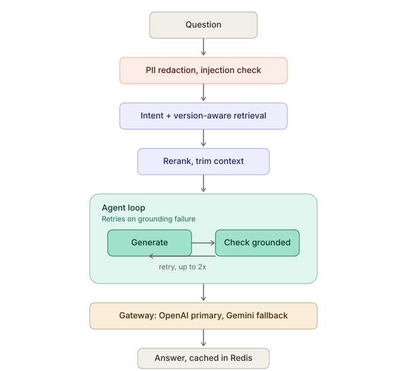

# Policy Copilot

Agentic RAG service over real US financial-services regulations (17 CFR 275, 16 CFR 314, 12 CFR 1005), built as a full production-grade AI engineering project: evaluation, guardrails, token optimization, latency, gateway routing, and agentic self-correction, deployed on GCP.

See DESIGN.md for the full architecture roadmap and DECISIONS.md for the complete, honest decision log (50+ entries) of what was built, what broke, and how it was fixed.

## What this actually does

Ask a question about US financial-services regulations. The system retrieves relevant, version-aware regulatory text (handles "what changed since 2023" questions correctly, not just "what is the current rule"), generates a grounded answer through an LLM gateway with automatic provider fallback, runs the answer through a self-correcting agent loop that retries on detected grounding failures, and returns the answer with verifiable citations.

## Quick start (local)

    docker compose up -d
    python3 -m venv .venv && source .venv/bin/activate
    uv sync
    uvicorn app.api.main:app --port 8080

Ingest real data (one-time, ~10 min):

    python3 -m app.rag.ingest

Test:

    curl -X POST localhost:8080/query -H "Content-Type: application/json" -d '{"question": "has 314.2 changed since 2023"}'

## Cloud deployment

See RUNBOOK.md for the full, tested deployment sequence. Real infrastructure via Terraform (infra/): Cloud SQL (pgvector), Memorystore Redis, VPC connector, Secret Manager, Cloud Run (API + LiteLLM gateway).

## Architecture

Question flows through: PII redaction and injection detection (Phase 6 guardrails), intent classification (point-in-time / diachronic / historical), two-stage retrieval (semantic resolve + relational lineage expand), reranking (cross-encoder, cuts context roughly in half), a LangGraph agent that generates and checks grounding, retrying up to twice on failure with hard caps ($0.05, 30s wall-clock), generation via the LiteLLM gateway with OpenAI primary and Gemini fallback, and a Redis exact-match cache keyed on retrieved content rather than raw question text. The answer returns with citations and honest grounding/cost signals.

## Project structure

    app/api/         FastAPI entrypoint: /query, /health-live, /readyz
    app/rag/          retrieval, generation, caching, reranking, ingest
    app/agents/       LangGraph self-correction loop
    app/guardrails/   PII redaction, injection detection
    app/gateway/      LiteLLM key-management CLI
    app/telemetry/    cost/token accounting
    evals/            Ragas + custom metrics, CI gate, golden set
    redteam/          49-attack injection test suite
    infra/            Terraform, all cloud resources
    scripts/          one-off exploration/diagnostic tools
    DESIGN.md         original architecture roadmap
    DECISIONS.md      full decision log, every real bug documented
    RUNBOOK.md        tested step-by-step deploy/teardown sequence

## Known, documented gaps

Not hidden -- see DECISIONS.md for full detail on each.

- D20: one diachronic date-attribution hallucination remains unresolved; the agent loop detects it (agent_grounded: false) but cannot always fix it within retry limits.
- D49: eCFR blocks Cloud Run's IP range; ingest must run locally through a Cloud SQL proxy tunnel, not as a Cloud Run Job.
- D50: LiteLLM's Cloud Run service is public (master-key-protected only), not IAM-locked to the API service -- a deliberate, documented trade-off pending a proper identity-token fix.
- Golden set at 16/50 items; judge calibration (Cohen's kappa) not done.
- Citation-format compliance ([cite: ...] tags) is inconsistently emitted by the model; caught but not fully corrected.

## Testing

    uv run pytest tests/
    python3 -m evals.runners.ci_gate
    python3 redteam/run.py
# CI/CD trigger test Mon Aug 24 11:30:00 UTC 2026
